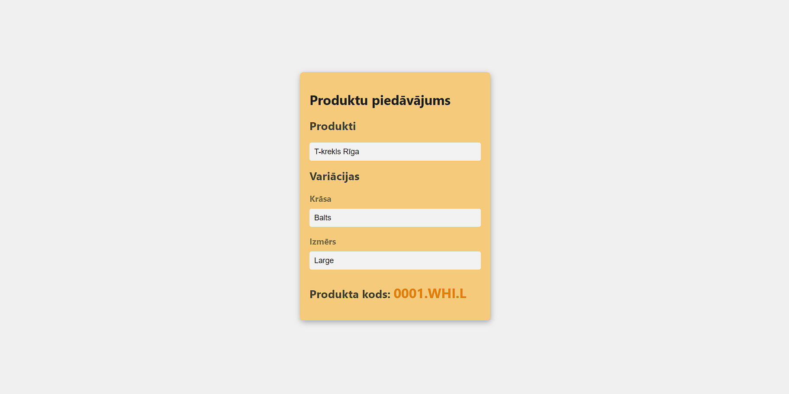

# Product Selector

Product menu that generates the relevant product code when the product and variations are selected. Developed with React and TypeScript.

## How to start a project?

- Clone the repository: `https://github.com/resnaiz/product-selector.git`
- Install dependencies: `npm install`
- Start the server: `npm start`
- Open `http://localhost:3000` in your browser and enjoy!

## Functions

- Select a product from the offer
- Choose product variations such as colour
- The new product code is displayed at the bottom of the app

## Author

This application was developed by Arnis Petersons.

## Screenshots

  <b>Application</b> 
  

